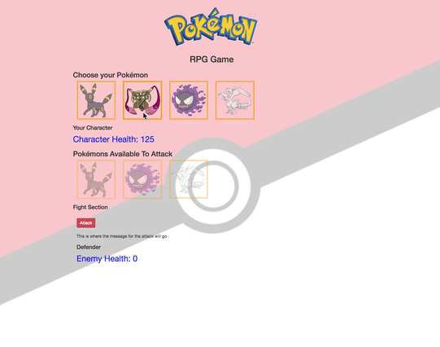

## Pokemon RPG - A web based Javascript Pokemon RPG Game.  

A Web based Javascript/ HTML5/ CSS Pokemon RPG application that lets users pick a Pokemon to fight other Pokemon to the end.

## Live Demo

[See Pokemon RPG Live](https://pokemonrpgweek4.herokuapp.com/)

## Usage

1. Clone repo
2. npm install
3. cd PokemonRPG
4. open index.html in any browser
5. Follow game instruction and choose a character. 
6. ENJOY! 

## Contributing

1. Fork it!
2. Create your feature branch: `git checkout -b my-new-feature`
3. Commit your changes: `git commit -am 'Add some feature'`
4. Push to the branch: `git push origin my-new-feature`
5. Submit a pull request :D

## Tech Used 

* HTML5 
* CSS 
* JAVASCRIPT 
* CSS 

## License
N/A.
